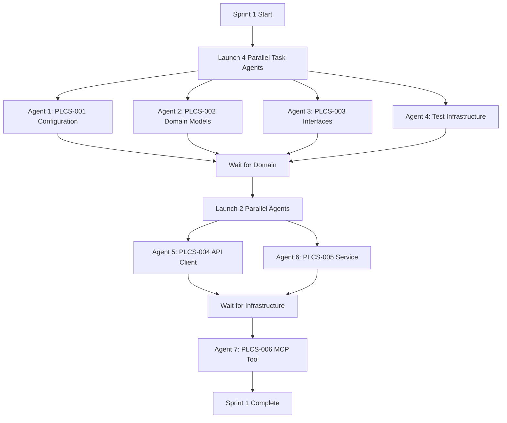

# Task-Driven Development Framework

## Core Principles

1. **Parallel Execution**: Use multiple Task agents to work on independent stories simultaneously
2. **Todo-Driven**: Each Task agent maintains its own todo list for tracking progress
3. **Test-First**: Write tests before implementation (TDD)
4. **Layer Independence**: Stories in different layers can be developed in parallel

## Execution Strategy

### Sprint 1 Parallel Execution Plan



## Task Agent Templates

### Configuration Layer Agent (PLCS-001)

```markdown
## Task: Implement Configuration Layer

### Todo List:
1. [ ] Set up project structure with uv
2. [ ] Create config package structure
3. [ ] Write tests for Settings model
4. [ ] Implement Settings with Pydantic
5. [ ] Add environment variable loading
6. [ ] Create .env.example file
7. [ ] Write integration tests
8. [ ] Update documentation
9. [ ] Create PR

### Implementation Order:
1. Test file first (TDD)
2. Implementation to pass tests
3. Documentation
4. PR creation
```

### Domain Layer Agent (PLCS-002)

```markdown
## Task: Implement Domain Models

### Todo List:
1. [ ] Create domain package structure
2. [ ] Write tests for Location model
3. [ ] Implement Location with validation
4. [ ] Write tests for Place model
5. [ ] Implement Place with validation
6. [ ] Write tests for SearchQuery
7. [ ] Implement SearchQuery
8. [ ] Create domain exceptions
9. [ ] Add model methods (distance calculation)
10. [ ] Create PR

### Parallel Safety:
- No dependencies on other stories
- Can run simultaneously with PLCS-001, PLCS-003
```

## Task Agent Prompts

### Agent 1: Configuration Layer
```
Create a Task agent to implement PLCS-001 (Configuration Layer).

Requirements:
1. Read issue #1 for acceptance criteria
2. Follow TDD - write tests first
3. Create a todo list and track progress
4. Implement Settings model with Pydantic
5. Support .env file loading
6. Validate GOOGLE_API_KEY format
7. Create comprehensive tests
8. Document configuration options
9. Create PR that closes #1

Use todo tracking throughout and update progress after each step.
```

### Agent 2: Domain Models
```
Create a Task agent to implement PLCS-002 (Domain Models).

Requirements:
1. Read issue #2 for acceptance criteria
2. Follow TDD - write tests first
3. Create a todo list and track progress
4. Implement Place, Location, SearchQuery models
5. Add validation rules
6. Implement distance_to method on Location
7. Create domain exceptions
8. Achieve >90% test coverage
9. Create PR that closes #2

Work in parallel with other domain/config agents.
```

### Agent 3: Repository Interfaces
```
Create a Task agent to implement PLCS-003 (Repository Interfaces).

Requirements:
1. Read issue #3 for acceptance criteria
2. Follow TDD approach
3. Create a todo list and track progress
4. Define PlacesRepository protocol
5. Create comprehensive type hints
6. Implement MockPlacesRepository
7. Document interface patterns
8. Create PR that closes #3

This can run in parallel with PLCS-001 and PLCS-002.
```

### Agent 4: Test Infrastructure
```
Create a Task agent to set up test infrastructure.

Requirements:
1. Create a todo list for tracking
2. Set up pytest configuration
3. Create test fixtures for common needs
4. Set up coverage configuration
5. Create test data builders
6. Set up integration test helpers
7. Configure CI/CD for tests
8. Document testing approach

This enables TDD for all other agents.
```

## Synchronization Points

### After Domain/Config Complete
```
Check all domain and config stories are complete:
- [ ] PLCS-001 PR merged
- [ ] PLCS-002 PR merged  
- [ ] PLCS-003 PR merged
- [ ] Test infrastructure ready

Then launch:
- Agent 5: PLCS-004 (Infrastructure)
- Agent 6: PLCS-005 (Application)
```

### After Infrastructure/Application Complete
```
Check infrastructure and application ready:
- [ ] PLCS-004 PR merged
- [ ] PLCS-005 PR merged

Then launch:
- Agent 7: PLCS-006 (Presentation)
```

## TDD Workflow for Each Agent

### 1. Test First
```python
# tests/test_models.py
def test_location_validates_latitude():
    with pytest.raises(ValidationError):
        Location(latitude=91, longitude=0)  # Invalid latitude
```

### 2. Implement to Pass
```python
# places_mcp/domain/models.py
class Location(BaseModel):
    latitude: float = Field(ge=-90, le=90)
    longitude: float = Field(ge=-180, le=180)
```

### 3. Refactor
- Improve code quality
- Add documentation
- Ensure clean design

### 4. Update Todo
```
- [x] Write tests for Location model
- [x] Implement Location with validation
- [ ] Write tests for Place model
```

## Parallel Execution Commands

### Launch All Initial Agents
```python
# Claude will execute these in parallel
agents = [
    Task("Configuration Layer", prompt_1),
    Task("Domain Models", prompt_2),
    Task("Repository Interfaces", prompt_3),
    Task("Test Infrastructure", prompt_4)
]
```

### Monitor Progress
Each agent maintains its own todo list:
- Agent 1 todos: 9 items for configuration
- Agent 2 todos: 10 items for domain models
- Agent 3 todos: 8 items for interfaces
- Agent 4 todos: 8 items for test setup

## Benefits of Parallel TDD

1. **Faster Development**: 4x speed on independent tasks
2. **Better Quality**: Tests written first
3. **Clear Progress**: Todo lists track everything
4. **No Conflicts**: Layer separation prevents issues
5. **Continuous Integration**: Each PR can merge independently

## Task Agent Guidelines

### Do's
- ✅ Create detailed todo lists
- ✅ Update todos after each step
- ✅ Write tests first (TDD)
- ✅ Check dependencies before starting
- ✅ Create atomic commits
- ✅ Document as you go

### Don'ts
- ❌ Skip tests
- ❌ Work on dependent stories in parallel
- ❌ Merge without tests passing
- ❌ Forget to update todos
- ❌ Create large PRs

## Sprint 1 Execution Timeline

### Phase 1: Parallel Foundation (2-3 hours)
- 4 agents work simultaneously
- Complete configuration, domain, and test setup
- 15 story points completed

### Phase 2: Parallel Services (2-3 hours)
- 2 agents work on infrastructure and application
- 13 story points completed
- Depends on Phase 1

### Phase 3: Presentation Layer (1 hour)
- 1 agent completes MCP tool
- 5 story points
- Depends on Phase 2

### Total: 6-7 hours for entire Sprint 1

## Success Metrics

Each Task agent succeeds when:
1. All todos are checked off
2. Tests pass with >80% coverage
3. PR is created and CI passes
4. Issue is automatically closed
5. No merge conflicts

## Next Sprint Planning

While Sprint 1 executes, we can:
1. Create Sprint 2 stories in GitHub
2. Plan parallel execution strategy
3. Identify dependencies
4. Prepare test scenarios

This approach maximizes Claude's ability to work in parallel while maintaining quality through TDD and todo tracking.